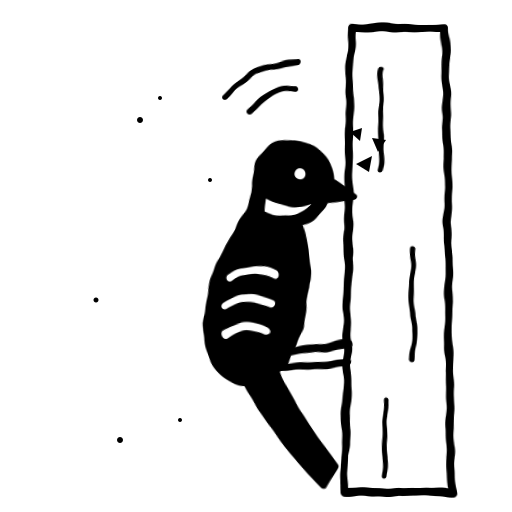

<a id="readme-top"></a>

<!-- PROJECT SHIELDS -->
[![Python][python-shield]][python-url]
[![Claude][claude-shield]][claude-url]
[![Telegram][telegram-shield]][telegram-url]
[![License: MIT][license-shield]][license-url]

<!-- PROJECT LOGO -->
<br />
<div align="center">
  <a href="https://github.com/gautierlp/woodpecker">
    <picture>
      <source media="(prefers-color-scheme: dark)" srcset="docs/assets/woodpecker-logo-dark.svg">
      
    </picture>
  </a>

  <h1 align="center">woodpecker</h1>

  <p align="center">
    <em>It knocks at 6 am. It knocks at noon. It knocks until the task is done.</em>
    <br />
    <br />
    A Telegram bot that keeps pecking at the tasks you avoid.
    <br />
    <a href="#usage"><strong>See what it says »</strong></a>
    <br />
    <br />
    <a href="src/woodpecker/selection.py">Read the rule</a>
    &middot;
    <a href="https://github.com/gautierlp/woodpecker/issues/new">Report bug</a>
    &middot;
    <a href="https://github.com/gautierlp/woodpecker/issues/new">Request feature</a>
  </p>
</div>

<!-- TABLE OF CONTENTS -->
<details>
  <summary>Table of contents</summary>
  <ol>
    <li>
      <a href="#about-the-project">About the project</a>
      <ul>
        <li><a href="#built-with">Built with</a></li>
      </ul>
    </li>
    <li>
      <a href="#getting-started">Getting started</a>
      <ul>
        <li><a href="#prerequisites">Prerequisites</a></li>
        <li><a href="#installation">Installation</a></li>
        <li><a href="#configuration">Configuration</a></li>
      </ul>
    </li>
    <li><a href="#usage">Usage</a></li>
    <li><a href="#how-it-works">How it works</a></li>
    <li><a href="#faq">FAQ</a></li>
    <li><a href="#roadmap">Roadmap</a></li>
    <li><a href="#contributing">Contributing</a></li>
    <li><a href="#license">License</a></li>
    <li><a href="#contact">Contact</a></li>
    <li><a href="#acknowledgments">Acknowledgments</a></li>
  </ol>
</details>

<!-- ABOUT THE PROJECT -->
## About the project

"Call the accountant" has been on your list for nine days. You have looked at it every
morning. You have done six easier things instead, every morning.

A todo list waits for you. A woodpecker does not. You text it your tasks in plain words,
and it files them in Vikunja. At 6 am it picks the frog, the one task you least want to
do, and puts it at the top of the message. Then it comes back at 9, 13 and 19. A task
that matters and has not moved in three days gets louder each time. Before it gets
loud, it asks what is blocking you.

It stops at 23:00. It starts again at 6.

<p align="right">(<a href="#readme-top">back to top</a>)</p>

### Built with

* [![Python][python-shield]][python-url]
* [python-telegram-bot](https://github.com/python-telegram-bot/python-telegram-bot) for the chat
* [Claude](https://www.anthropic.com/claude) (Haiku 4.5) to read your messages and write the nags
* [Vikunja](https://vikunja.io/) as the task store, over its REST API
* APScheduler for the 6 am message and the nags
* SQLite for the bot's own state (when it last nagged, the last list it showed you)
* Docker, one container

<p align="right">(<a href="#readme-top">back to top</a>)</p>

<!-- GETTING STARTED -->
## Getting started

### Prerequisites

* Python 3.12 or newer and [uv](https://docs.astral.sh/uv/)
* A Telegram bot token from [@BotFather](https://t.me/BotFather), and your own chat id
* An Anthropic API key
* A Vikunja instance, a project to hold the backlog, and an API token

### Installation

1. Clone the repo
   ```sh
   git clone https://github.com/gautierlp/woodpecker.git
   cd woodpecker
   ```
2. Install and run the tests
   ```sh
   uv sync --extra dev
   uv run pytest
   ```
3. Create the env file and fill it in
   ```sh
   cp .env.example .env
   ```
4. Start the bot
   ```sh
   uv run woodpecker
   ```

To run it on a server, `docker compose up -d --build` does the same in a container.
The workflow in `.github/workflows/deploy.yml` redeploys it on every push to `main`
from a self-hosted runner.

### Configuration

All settings live in `.env`:

| Variable | Default | What it does |
|---|---|---|
| `TELEGRAM_BOT_TOKEN` | none | The bot token. Required. |
| `TELEGRAM_CHAT_ID` | none | Your chat id. The bot talks to no one else. Required. |
| `ANTHROPIC_API_KEY` | none | Required. |
| `VIKUNJA_URL`, `VIKUNJA_TOKEN`, `VIKUNJA_PROJECT_ID` | none | Where the backlog lives. Required. |
| `WOODPECKER_DB_PATH` | `data/sidecar.db` | The bot's own SQLite file. |
| `WOODPECKER_LOG_LEVEL` | `INFO` | `DEBUG` logs every message and every Claude call. |
| `WOODPECKER_LOG_FILE` | `logs/woodpecker.log` | Empty turns the file log off. |

The old `JOLT_*` names still work. The nag hours, the quiet hours and the three-day
threshold are constants at the top of `src/woodpecker/config.py`.

<p align="right">(<a href="#readme-top">back to top</a>)</p>

<!-- USAGE -->
## Usage

There are no commands to learn. You write to it like a person:

```
you         book the vet, important
woodpecker  Got it. "Book the vet", flagged important. By when?
you         this week
woodpecker  Noted, due Friday.

you         done with the vet
woodpecker  Done, nice.
```

At 6 am:

```
woodpecker  Frog first: call the accountant. Nine days now, and it takes ten minutes.
            Also waiting: sort the insurance (5 days), renew the passport (4 days).

            Full list:
            1. Call the accountant
            2. Sort the insurance
            ...
```

When a task that matters goes stale:

```
woodpecker  "Sort the insurance" has sat for 4 days. What is blocking it?
            Break it down, or drop it?
```

Say "it's a someday thing" and it backs off.

<p align="right">(<a href="#readme-top">back to top</a>)</p>

<!-- HOW IT WORKS -->
## How it works

The code splits the work in two. Claude does what needs judgment: it reads your
message, works out the intent, and writes the 6 am message and the nags. Plain Python
does everything mechanical: the full backlog list, the age of each task, the order,
the quiet hours, the schedule. A list you rely on should never be reworded by a model.

1. **You write.** Claude turns the message into one or more intents (add, complete,
   drop, reschedule, edit) and the bot applies them to Vikunja.
2. **6 am.** The bot picks the frog from the tasks due today or overdue, at Medium
   priority or higher. Claude writes two to four lines about it. The full list follows,
   built by code.
3. **9, 13, 19.** If the frog has not moved, a nag. The evening one is blunter.
4. **Three days untouched.** The task becomes a candidate. Priority decides how hard
   the bot pushes. A stale important task goes to the top and gets loud. A stale
   low-priority one stays quiet, and the bot suggests you drop it.

Vikunja holds every task. The bot keeps no copy of the list, only its own state in
SQLite: when it last nagged about each task, and the order of the last list it sent,
so "done with 3" means the third line you saw.

<p align="right">(<a href="#readme-top">back to top</a>)</p>

<!-- FAQ -->
## FAQ

**Is it annoying?**
That is the point. It is built for one person, and nagging works on that person.
It still keeps quiet from 23:00 to 6:00, and it asks before it pushes.

**Why Vikunja and not its own database?**
The tasks should outlive the bot. Vikunja has a web app and a phone app, so you can
edit the list when the bot is down.

**Can several people use it?**
No. It answers one chat id and ignores everyone else.

**Why a woodpecker?**
A woodpecker hits the same spot of the same tree, again and again, until it gets
through. It also eats insects that hide under the bark, which is where
your oldest tasks are.

<p align="right">(<a href="#readme-top">back to top</a>)</p>

<!-- ROADMAP -->
## Roadmap

- [x] Plain-language capture with Claude
- [x] The 6 am frog and the three nags
- [x] Stale detection, ranked by priority
- [x] Vikunja as the task store
- [x] Docker deploy with a self-hosted runner

See the [open issues](https://github.com/gautierlp/woodpecker/issues) for the rest.

<p align="right">(<a href="#readme-top">back to top</a>)</p>

<!-- CONTRIBUTING -->
## Contributing

Contributions are welcome. The project uses TDD: write the test, watch it fail, then
write the code. Tests mock Telegram, Claude and Vikunja, so they need no keys.

```sh
uv run pytest
uv run ruff check .
```

1. Fork the project
2. Create your feature branch (`git checkout -b feat/amazing-feature`)
3. Commit your changes (`git commit -m 'feat: add amazing feature'`)
4. Push to the branch (`git push origin feat/amazing-feature`)
5. Open a pull request

<p align="right">(<a href="#readme-top">back to top</a>)</p>

<!-- LICENSE -->
## License

Distributed under the MIT License. See [`LICENSE`](LICENSE).

<p align="right">(<a href="#readme-top">back to top</a>)</p>

<!-- CONTACT -->
## Contact

Gautier Le Poher - gautier@lepoher.co

Project link: [https://github.com/gautierlp/woodpecker](https://github.com/gautierlp/woodpecker)

<p align="right">(<a href="#readme-top">back to top</a>)</p>

<!-- ACKNOWLEDGMENTS -->
## Acknowledgments

* Brian Tracy, *Eat That Frog!*, for the frog
* [Vikunja](https://vikunja.io/)
* [python-telegram-bot](https://github.com/python-telegram-bot/python-telegram-bot)
* [Anthropic Claude](https://www.anthropic.com/claude)
* [Shields.io](https://shields.io)

<p align="right">(<a href="#readme-top">back to top</a>)</p>

<!-- MARKDOWN LINKS & IMAGES -->
[python-shield]: https://img.shields.io/badge/Python-3.12+-3776AB?style=for-the-badge&logo=python&logoColor=white
[python-url]: https://www.python.org/
[claude-shield]: https://img.shields.io/badge/Claude-Haiku%204.5-D97757?style=for-the-badge&logo=anthropic&logoColor=white
[claude-url]: https://www.anthropic.com/claude
[telegram-shield]: https://img.shields.io/badge/Telegram-bot-26A5E4?style=for-the-badge&logo=telegram&logoColor=white
[telegram-url]: https://github.com/python-telegram-bot/python-telegram-bot
[license-shield]: https://img.shields.io/badge/License-MIT-yellow?style=for-the-badge
[license-url]: #license
