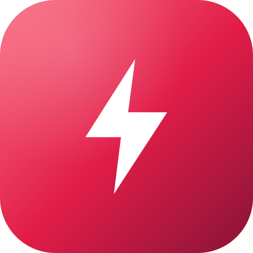

<a id="readme-top"></a>

<!-- PROJECT SHIELDS -->
[![License: MIT][license-shield]][license-url]
[![Python][python-shield]][python-url]
[![Powered by Claude][claude-shield]][claude-url]
[![Status][status-shield]][status-url]

<!-- PROJECT LOGO -->
<br />
<div align="center">
  <a href="https://github.com/gautierlp/jolt">
    
  </a>

  <h3 align="center">Jolt</h3>

  <p align="center">
    The one-thing accountability bot. One focused task a day, and no hiding from it.
    <br />
    <a href="docs/superpowers/specs/2026-07-12-accountability-bot-design.md"><strong>Read the design spec »</strong></a>
    <br />
    <br />
    <a href="https://github.com/gautierlp/jolt/issues">Report Bug</a>
    &middot;
    <a href="https://github.com/gautierlp/jolt/issues">Request Feature</a>
  </p>
</div>

<!-- TABLE OF CONTENTS -->
<details>
  <summary>Table of Contents</summary>
  <ol>
    <li>
      <a href="#about-the-project">About The Project</a>
      <ul>
        <li><a href="#how-it-works">How It Works</a></li>
        <li><a href="#built-with">Built With</a></li>
      </ul>
    </li>
    <li>
      <a href="#getting-started">Getting Started</a>
      <ul>
        <li><a href="#prerequisites">Prerequisites</a></li>
        <li><a href="#installation">Installation</a></li>
      </ul>
    </li>
    <li>
      <a href="#usage">Usage</a>
      <ul>
        <li><a href="#talking-to-jolt">Talking to Jolt</a></li>
        <li><a href="#the-daily-rhythm">The daily rhythm</a></li>
        <li><a href="#the-avoidance-hunter">The avoidance hunter</a></li>
      </ul>
    </li>
    <li><a href="#roadmap">Roadmap</a></li>
    <li><a href="#contributing">Contributing</a></li>
    <li><a href="#license">License</a></li>
    <li><a href="#contact">Contact</a></li>
    <li><a href="#acknowledgments">Acknowledgments</a></li>
  </ol>
</details>

<!-- ABOUT THE PROJECT -->
## About The Project

[![Jolt][product-cover]](docs/assets/jolt-social.png)

> 🚧 **Early days.** The design is locked (see the [spec](docs/superpowers/specs/2026-07-12-accountability-bot-design.md)); the bot itself is not built yet. The Usage section below describes the *intended* interface, not shipped behavior.

Jolt is a private Telegram bot that fights task avoidance. Most todo apps just hold a list, and a long list is itself the thing that overwhelms you into doing nothing. Jolt does the opposite: it keeps your backlog out of sight, surfaces **one focused thing a day**, and gets pointedly insistent about tasks you have been quietly postponing.

It is built around one personal fact: persistent nagging actually works on its user. So Jolt leans into persistence rather than passivity, while staying humane (it asks what is blocking you before it gets loud, and it never pings during quiet hours).

Single-user, self-hosted, not a SaaS.

<p align="right">(<a href="#readme-top">back to top</a>)</p>

### How It Works

1. **Capture, friction-free.** You text Jolt naturally ("call the accountant by friday"). Claude reads it and files the task, asking once for context only if it matters.
2. **Daily focus at 06:00.** A short, Claude-written message names the single thing to do today plus any stale task that needs rescuing, followed by a plain, mechanical dump of the full backlog for reference.
3. **Nag through the day.** Morning, midday, evening. If the focus task is still untouched by evening, the tone gets more direct. Never before 06:00, never after 23:00.
4. **Hunt avoidance.** Anything sitting untouched for 3 days gets flagged. Jolt first asks what is blocking it (break it down? drop it?), and escalates only if you keep dodging.
5. **Close it out.** You say "done with the taxes" and Jolt marks it complete with a plain acknowledgment.

A deliberate split runs through the whole thing: **Claude** handles judgment and tone (parsing, intent, the focus and nag messages); **plain code** handles anything mechanical (the backlog dump, the stale-age math, ordering, quiet hours, scheduling). A mechanical list should never be reworded or hallucinated.

<p align="right">(<a href="#readme-top">back to top</a>)</p>

### Built With

[![Python][python-badge]][python-url]
[![Claude][claude-badge]][claude-url]
[![Telegram][telegram-badge]][telegram-url]
[![SQLite][sqlite-badge]][sqlite-url]
[![Docker][docker-badge]][docker-url]

- **[python-telegram-bot][telegram-url]** — the messaging layer
- **[Anthropic Claude][claude-url]** — interprets messages, writes the nudges
- **APScheduler** — fires the 06:00 focus, the nags, the daily stale-scan
- **SQLite** — one file, one `tasks` table
- **Docker** — one container on the homelab host

<p align="right">(<a href="#readme-top">back to top</a>)</p>

<!-- GETTING STARTED -->
## Getting Started

### Prerequisites

- **Python ≥ 3.12**
- **[uv](https://docs.astral.sh/uv/)** for dependency management
- A **Telegram bot token** (from [@BotFather](https://t.me/BotFather))
- An **Anthropic API key** (`ANTHROPIC_API_KEY`)

### Installation

```bash
git clone https://github.com/gautierlp/jolt.git
cd jolt
uv sync                       # create the virtualenv and install dependencies
cp .env.example .env          # then fill in your Telegram + Anthropic keys
uv run python src/main.py     # run locally
```

> The `src/` app does not exist yet — this is the intended setup once implementation lands. Track progress in the [Roadmap](#roadmap).

<p align="right">(<a href="#readme-top">back to top</a>)</p>

<!-- USAGE -->
## Usage

### Talking to Jolt

There are no rigid commands. You text Jolt like a person, and Claude works out what you meant:

```
you  → book the vet, important
Jolt → Got it. "Book the vet" — flagged important. Anything by when?
you  → this week
Jolt → Noted, due Friday.

you  → what should I do today?
Jolt → One thing: book the vet (due Friday). If you do nothing else, do this.

you  → done with the vet
Jolt → Done, nice.
```

### The daily rhythm

- **06:00** — the focus message (one task + any rescues), then the full backlog underneath.
- **Morning / midday / evening** — up to three nudges on the focus task; blunter by evening if untouched.
- **Quiet hours** — nothing before 06:00 or after 23:00, ever.

### The avoidance hunter

A task untouched for **3 days** is flagged as stale. Jolt gets curious before it gets loud:

```
Jolt → "Sort the insurance" has sat 4 days. What's actually blocking it —
       want to break it down, or drop it?
```

Keep dodging and it escalates. Say "it's a someday thing" and it backs off. The threshold and quiet hours are single constants, easy to tune once it is running.

<p align="right">(<a href="#readme-top">back to top</a>)</p>

<!-- ROADMAP -->
## Roadmap

- [x] Design spec ([`docs/superpowers/specs/`](docs/superpowers/specs/2026-07-12-accountability-bot-design.md))
- [x] Brand identity (icon + cover)
- [ ] Implementation plan
- [ ] Storage + task logic (SQLite, add/complete/drop, ordering)
- [ ] Stale detection + daily-focus selection (pure, tested)
- [ ] Claude message interpretation + intent classification
- [ ] Telegram layer + scheduler (06:00 focus, nags, stale-scan)
- [ ] Deploy to `jarvis` (Docker + git auto-deploy)

See the [open issues](https://github.com/gautierlp/jolt/issues) for the running list.

<p align="right">(<a href="#readme-top">back to top</a>)</p>

<!-- CONTRIBUTING -->
## Contributing

This is a private, single-user project, so there is no open contribution flow. If you are an AI assistant working on this repo, the conventions live in [`CLAUDE.md`](CLAUDE.md): TDD on the pure logic, mock the external APIs, follow the `billie_bot` / `fitness-data` patterns.

<p align="right">(<a href="#readme-top">back to top</a>)</p>

<!-- LICENSE -->
## License

Distributed under the MIT License. See [`LICENSE`](LICENSE) for more information.

<p align="right">(<a href="#readme-top">back to top</a>)</p>

<!-- CONTACT -->
## Contact

Gautier Le Poher — gautier@lepoher.co

Project Link: [https://github.com/gautierlp/jolt](https://github.com/gautierlp/jolt)

<p align="right">(<a href="#readme-top">back to top</a>)</p>

<!-- ACKNOWLEDGMENTS -->
## Acknowledgments

- [Anthropic Claude](https://www.anthropic.com/claude) — the model behind the nudges
- [`billie_bot`](https://github.com/gautierlp/billie_bot) and `fitness-data` — the homelab patterns this bot is modeled on
- [Best-README-Template](https://github.com/othneildrew/Best-README-Template) — the structure of this README

<p align="right">(<a href="#readme-top">back to top</a>)</p>

<!-- MARKDOWN LINKS & IMAGES -->
[license-shield]: https://img.shields.io/badge/license-MIT-blue.svg?style=for-the-badge
[license-url]: https://github.com/gautierlp/jolt/blob/main/LICENSE
[python-shield]: https://img.shields.io/badge/python-%E2%89%A53.12-3776AB.svg?style=for-the-badge&logo=python&logoColor=white
[python-url]: https://www.python.org/
[claude-shield]: https://img.shields.io/badge/powered%20by-Claude-D97757.svg?style=for-the-badge&logo=anthropic&logoColor=white
[claude-url]: https://www.anthropic.com/claude
[status-shield]: https://img.shields.io/badge/status-in%20design-E11D48.svg?style=for-the-badge
[status-url]: #roadmap
[product-cover]: docs/assets/jolt-social.png
[python-badge]: https://img.shields.io/badge/Python-3776AB?style=for-the-badge&logo=python&logoColor=white
[claude-badge]: https://img.shields.io/badge/Claude-D97757?style=for-the-badge&logo=anthropic&logoColor=white
[telegram-badge]: https://img.shields.io/badge/Telegram-26A5E4?style=for-the-badge&logo=telegram&logoColor=white
[telegram-url]: https://github.com/python-telegram-bot/python-telegram-bot
[sqlite-badge]: https://img.shields.io/badge/SQLite-003B57?style=for-the-badge&logo=sqlite&logoColor=white
[sqlite-url]: https://www.sqlite.org/
[docker-badge]: https://img.shields.io/badge/Docker-2496ED?style=for-the-badge&logo=docker&logoColor=white
[docker-url]: https://www.docker.com/
